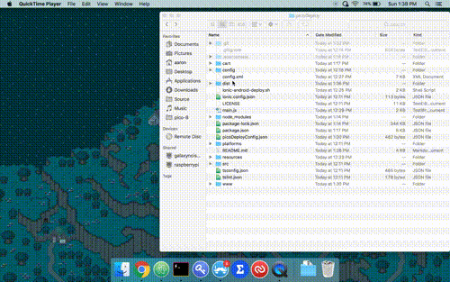
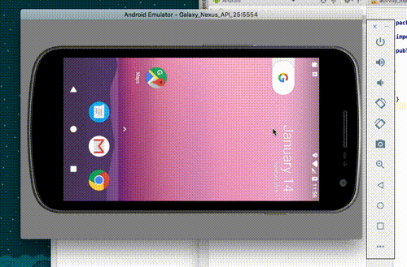
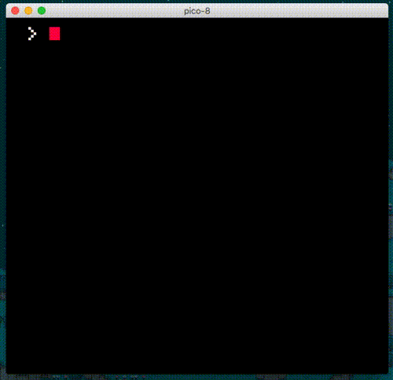
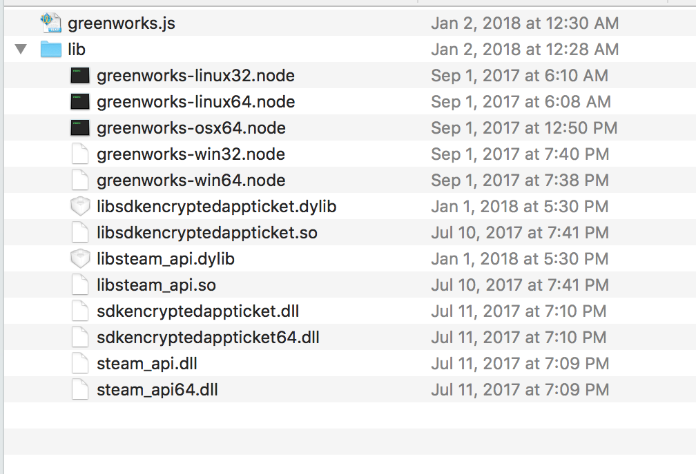

# picoDeploy

👾 *Deploy Pico-8 Games Anywhere and Everywhere!* 👾




**Example .gifs show the jelpi demo cart. Included cart is different.**

# Table Of Contents 📚

* [Introduction](#introduction)
* [Features](#features)
* [Getting Started](#getting-started)
* [Key Gotchas and Caveats](#key-gotchas-and-caveats)
* [Keyboard Controls](#keyboard-controls)
* [Project Layout](#project-layout)
* [Usage](#usage)
  * [To add your own carts](#to-add-your-own-carts)
  * [Npm Scripts / CLI](#npm-scripts--cli)
  * [picoDeployConfig.json](#picodeployconfigjson)
* [Example Projects](#example-projects)
* [Building and Deploying for Web](#building-and-deploying-for-web)
* [Building and Deploying for Desktop](#building-and-deploying-for-desktop)
* [Building and Deploying for Android](#building-and-deploying-for-android)
* [Building and Deploying for iOS](#building-and-deploying-for-ios)
* [Adding Support for Game Distribution Platforms](#adding-support-for-game-distribution-platforms)
  * [Google Play](#google-play-games)
  * [Steam (Greenworks)](#steam-greenworks)
* [Parent Projects and Dependencies](#parent-projects-and-dependencies)
* [Contributing](#contributing)
* [LICENSE](#license)

# Introduction

This project started because I found pico-8 and started building a small hackathon-style game, called [Get Dis Money](https://getdismoney.com), for a local meetup called Code && Coffee, Long Beach. I was used to building games in Unity, but wanted to try something less serious and more fun. After showing the game to some friends, and writing more and more code for the game. I thought, what if I actually tried to write a deployable version of the game? Then I came across [this article](http://missingsentinelsoftware.com/blog/deploying-pico-8-cartridges-electron) by josefnpat, and figured why not. I have been developing Javascript (Node.js) for about 4 years, and have built plenty of Electron apps in the past. However, I also wanted to build for mobile, (Android and iOS), and at the time pico-8 only deployed to web. I thought I'd take it even further, and commit the ultimate web developer sin 😈. I have been using Ionic since when it was still in beta (before v1), and thought, why not just put Ionic inside of electron? I mean this whole project was all for fun, why not make the write-it-once-and-literally-deploy-anywhere wrapper for pico-8? And that is how we got **picoDeploy**.

# Features

* 🖥️ Deploy to Windows, Mac, and Linux using [Electron](https://electronjs.org/) and [Electron Builder](https://github.com/electron-userland/electron-builder)
* 📱 Deploy to Android, iOS, and Web with all listed features using [Ionic](https://ionicframework.com/)
* 🚀 Performant mobile builds using [Crosswalk](https://github.com/crosswalk-project/cordova-plugin-crosswalk-webview)
* 💾 Save file (Indexedb) listener, with Pub / Sub functionality to perform actions when the save file is changed
* 🎮 Mobile on screen gamepad using [Google Material Icons](https://material.io/icons/)
* 🎮 Usb Gamepad / Xbox 360 controller / PS3 controller support using a modified [pico8gamepad](https://github.com/krajzeg/pico8gamepad)
* 💦 Splashscreen / Video to hide the Pico 8 boot screen (Not to be mistaken with Ionic mobile app splash screen)
* 📺 Background image or video to be displayed behind your game
* ⚙️ Settings screen, with support for turning sound on / off, fullscreen for desktop, customizable gamepad color, customizable background color (if not background media), Stretch the game to full resolution, and dropdown credits.
* 🛠️ Build System to support multiple `picoDeployConfig.json` files, and copied for the correct build target set in ENV variables.
* ♻️ Compatible with libraries like [greenworks](https://github.com/greenheartgames/greenworks) and [Cordova Plugin Play Games Services](https://github.com/artberri/cordova-plugin-play-games-services). That can be plugged into a commented PlatformSdkWrapper service, which taps into the Save file listener I mentioned above

P.S I totally started this project before [version 0.1.11](https://www.lexaloffle.com/bbs/?tid=30219) which included binary exports for Windows, Mac, and Linux. However, this project still offers a great amount of functionality for deploying and building games, that binary exports do not offer currently.

# Getting Started

1. Install [Nodejs](https://nodejs.org/en/download/package-manager/). I suggest using [nvm](https://github.com/creationix/nvm).

2. Download this project as a zip, or fork it. This is a base project that yours project will be based upon.

2. Run `npm install` in the base directory of the project

3. Run `npm run ionic:serve`. And open [localhost:8100](http://localhost:8100) if it does not open it for you.

4. If a game starts running in your browser, then you are ready to go. Enjoy! 😊

# Key Gotchas and Caveats

* Minimum android version is 7.1.1 (sdk version 25). This is due to the [Web Audio API](https://caniuse.com/#feat=audio-api) and how around Android version 7, [android replaced their webview with Mobile Chrome](https://developer.android.com/about/versions/nougat/android-7.0.html#webview). Games can technically be played on Android versions below this, but there will be a weird [Audio Jitter / Crackle](https://www.lexaloffle.com/bbs/?tid=30573). If you are skeptical about any device, visit the new and awesome [playpico](http://playpico.com/) on the device to test the audio. Please feel free to click the previous link to join the discussion, or open an issue if you feel you may have a solution. I can confirm on my Pixel 2, and Nexus 5X the audio was fine. But on my roomate's LG G4, the audio jitters 😞.

* Adding support for Steamworks using [greenworks](https://github.com/greenheartgames/greenworks) will have many missing steam features, and can be quite finnicky. For instance, the Steam UI cannot be opened, even with mentioned hacks within the projects issues. However, most functionality such as logging into steam, and launching achievements should work.

# Keyboard Controls


([Image from pico8-api](https://neko250.github.io/pico8-api/))

Additional keyboard (⌨️) commands are:

* `o` for settings (options)
* `p` for pause
* `CMD + q` to quit

# Project Layout

* `cart/` - Where `cart.js` files are stored.
* `config/` - Where `picoDeployConfig.whatever.json` files are placed, and the `copyConfig.js` file lives to copy `picoDeployConfig.json` to the base of the project to be used by the application.
* `resources/` - Where app icons for Electron Builder and Ionic are stored
* `src/` - Where the source code for the Ionic application lives.
* `src/app` - The main app component
* `src/assets` - Where asstets for the application lives. Please take note of `src/assets/picomedia` where the splashscreen and things are stored
* `src/components` - Where The application components are stored. Such as the cart, and gamepad components
* `src/pages` - Where the Home and Settings page components are stored
* `src/providers` - Where the services are stored. Such as the Save file listener provider, and the Settings provider.
* `config.xml` - Ionic / Cordova Config for building the application
* `ionic-android-deploy.sh` - Script for easing the proccess of building signed android apks to upload to the Google Play Store.
* `main.js` - Electron Main process Javascript file. See [Electron Quick Start](https://github.com/electron/electron/blob/master/docs/tutorial/quick-start.md)
* `package.json` - Project file to define scripts and dependencies

# Usage

### To add your own carts

1. open pico-8
2. load your cart 🛒
3. export your cart with `CART_NAME.html`

Or just watch these steps in the gif below:



4. Copy the `.js` file that was export into `picoDeploy/cart`.
5. edit the `picoDeployConfig.json` file to include your cart instead of the included one.
6. Run `npm run ionic:serve`, and ensure that your cart is now the one being loaded!

### Npm Scripts / CLI

All of the scripts should be prepended with `npm run [script name]`, for instance `npm run ionic:serve`

The main scripts you will be using are the `ionic:x`, `electron:x`, and `android:x` scripts.

The android scripts will require you to set up your android environment, outlined in [Building and Deploying for Android](#building-and-deploying-for-android).

* `clean` - The default ionic project clean script
* `lint` - The default ionic project lint script
* `cart` - copies to the files within the  `cart/` folder to the built `www/cart` folder
* `config` - runs the `copyConfig.js` script, to copy the appropriate `picoDeployConfig.json` according to the ENV variables
* `build` - runs the default ionic project build script
* `serve` - runs the default ionic project build script
* `ionic:build` - runs the `cart`, `config`, and `build` scripts to build the complete picoDeploy app
* `ionic:serve` - runs the `cart`, `config`, and `build` scripts to serve / livereload the complete picoDeploy app for development
* `android:run` - exports Mobile ENV Variables, runs `cart`, and `config`, and then runs `ionic cordova run android --prod` to preview a build of the app on a connected android device, or android emulator
* `android:serve` - Same functionality as `ionic:serve`, but runs on an android device like `android:run`
* `android:build` - Similar to `android:run`, but builds an unsigned apk to be distributed.
* `android:deploy` - similar to `android:build`, but uses (and requires) a keystore to zipalign and sign built apks, by running the `ionic-android-deplpoy.sh` script
* `electron:serve` - Runs `ionic:build`, and runs the built files inside an electron container
* `electron:serve:nobuild` - Similar to `electron:serve`, but does not re-build the app. This is useful to testing changes on only the `main.js` file
* `electron:build` - Builds the application using [Electron Builder](https://github.com/electron-userland/electron-builder) for the current Operating system. This is useful for testing final production builds.
* `electron:deploy` - Similar to `electron:build`, but builds for all desktop platforms (Windows, Mac, and Linux), using the Electron builder configuration outlined in the `package.json`


### picoDeployConfig.json

Example / Inlined `picoDeployConfig.json` file with invalid json comment lines to describe each key:

```
{
  "cart": {
    "cartName": "getdismoney-community.js" // Name or path of the cart inside the cart/ directory
  },
  "picosplash": { // Settings reffering to the introduction splash screen that hides pico-8 booting
    "enable": true, // Boolean to enable or disable the pico splash
    "splashMedia": "assets/picomedia/splash.mp4" // HTML5 compliant image or video file to be displayed over the cart booting
  },
  "backgroundMedia": false, // HTML5 compliant image or video file to be displayed behind the cart. Set to false to disable
  "inactiveToExitDelayInMilli": 300000, // How long before killing the app if left in the background
  "defaultSettings": { // Default settings to set on the settings menu
    "fullscreen": true, // Start the app in full screen or not by default
    "sound": true, // Enable or disable sound by default
    "backgroundColor": "#272727", // backgroundColor displayed behind cart if no backgroundMedia
    "gamepadColor": "#FFFFFF", // Default color of the gamepad
    "stretch": false // Default to stretching the game to match the aspect ratio
  },
  "dbWatcher": { // Save file watcher config
    "enable": true, // Boolean to enable or disable the save file (Indexedb) watcher
    "cartDataName": "nocomplygames_letsgetdismoney_communitty_edition_v1" // String passed to cartdata() to be found in the Indexedb
  }
}
```

# Example Projects

A list of example project can be found at: [The Example Projects .md](./docs/EXAMPLE_PROJECTS.md)

# Building and Deploying for Web

For development, `npm run ionic:serve` will provide as a great place to test your carts, or any changes you make to the project. It offers livereloading for the project. However, for cart or config changes, this command will have to be re-run.

Simply running `npm run ionic:build` should give you a good desktop build. The built website should be located in the `www/` folder. Which can then be opened directly from your web browser, or uploaded to a site like [itch.io](https://itch.io/). I haven't personally tested this, but it should all work *in theory* 🤔. Please run at your own discretion.

# Building and Deploying for Desktop

For Development, run `npm run electron:serve`, which simply runs `npm run ionic:build`, and wraps the built project in an electron shell. This is really useful for testing changes to your `main.js` or desktop specific. Otherwise use `npm run ionic:serve`.

To test builds for desktop, run `npm run electron:build`. This really is just packing you www/ directory into an electron app that can be distributed. However the `electron:build` command will only build for the current OS and architecture. Which means it is great for ensuring that your electron builds are building correctly, and running great. Please notes, that my builds for [Get Dis Money](https://getdismoney.com), come out to be about ~200MB. Built files can be found in the `dist/` directory.

To build production builds for all platforms to be distributed and downloading on places like [itch.io](https://itch.io/) or your own distribution platform, run `npm run electron:deploy`. This will build for all available OS and architectures to be run by your users. Built files can be found in the `dist/android` directory.

For Icons and Backgrounds of builds, please refer to the [Electron Builder Icons Guide](https://www.electron.build/icons). I know it sates that for the Icons on Linux, it can optionally share the same Icon as macOS. However, It gave me strange builder errors, and I highly suggest just adding your linux icon as `resources/icons/512x512.png`. Like it states in the guide.

For any additional help, I'd highly suggest looking through the [Electron Builder Documentation](https://www.electron.build/), for anything you may be trying to achieve.

# Building and Deploying for Android

First, you will need to [add the android platform](https://ionicframework.com/docs/cli/cordova/platform/). However, you will need to set some paths in you `.bashrc`, which are outlined in [this guide](https://cordova.apache.org/docs/en/latest/guide/platforms/android/). This can be done with `ionic cordova platform add android@6.3.0`. If you notice, we are specifying cordova android 6.3.0. If you Google around, I guess there are some weird conflicts with Ionic, Cordova, and Crosswalk on Android 7.0, therefore I am specifying the version here. Use other versions at your own discretion. This should automatically add cordova plugins like [Crosswalk](https://github.com/crosswalk-project/cordova-plugin-crosswalk-webview). From there, you should now be able to run the android commands like, `npm run android:build`.

For generating icons and resources, please follow the [Ionic Docs on generating resources](https://ionicframework.com/docs/cli/cordova/resources/).

For development, run `npm run android:serve`, which will run your app inside the android Ionic shell, with livereloading. Similar to `npm run ionic:serve`, for cart or config changes, this command will have to be re-run. This is great for testing changes to the gamepad, or anything mobile specific. Otherwise use `npm run ionic:serve`.

To test builds, run `npm run android:build`, this will give you an unsigned development apk that you can install on your device manually. However, you need to enable [Unknown Sources](https://www.androidcentral.com/unknown-sources) on your android device. Though, newer android version will just prompt you for it. This apk cannot be placed on Google Play, as it needs to be signed and things. Built files can be found in the `dist/android` directory.

For production builds, run `npm run android:deploy`. This requires that you follow the [Ionic Deployment Guide](https://ionicframework.com/docs/intro/deploying/), and create a keystore for signing apks. This will run the `ionic-android-deploy.sh` script. And you will need to edit the script inside of the `package.json`, and insert the path to your keystore, and your keystore password (Please note, you may just want to run the `ionic-android-deploy.sh` script manually, if you are building your application publicly. As you should be very wary of uploading / sharing your keystore or password). Built files can be found in the `dist/android` directory. These built apks may be uploaded and distributed on Google Play.

If things aren't working, please refer to the [Ionic Deployment Guide](https://ionicframework.com/docs/intro/deploying/) as it should relatively be the same for this project.

# Building and Deploying for iOS

Personally, I do not have access to an iOS developer account, the fees are pretty high, or a physical iOS device. I could test this on my Mac iOS simulator, but I like testing on real hardware. Please feel free to write up some instructions for this, and contribute them to the project.

In the meantime, I'd suggest simply following the [Ionic Deployment Guide](https://ionicframework.com/docs/intro/deploying/) As it should relatively be the same for this project. Also, You will have to add the `ios` platform, similar to android.

For generating icons and resources, please follow the [Ionic Docs on generating resources](https://ionicframework.com/docs/cli/cordova/resources/).

# Adding Support for Game Distribution Platforms

### Google Play Games

Adding support for google play games is not too bad. Simply add the [Cordova Plugin Play Games Services](https://github.com/artberri/cordova-plugin-play-games-services), which is outlined on in its README on the repo I just linked. Then, refer to the [PlatformSdkWrapper](./src/providers/platform-sdk-wrapper/platform-sdk-wrapper.ts) for usage in the project.

### Steam (Greenworks)

This requires a Steamworks account, and application ID ready to be used. For information on getting your game on steam, [see here](https://support.steampowered.com/kb_article.php?ref=1657-WHKN-6841).

Okay, this one is quite a doozy. To add support for Steam, you will need to use [Greenworks](https://github.com/greenheartgames/greenworks). You may want to start by reading through the [greenworks Docs](https://github.com/greenheartgames/greenworks/tree/master/docs), but here is how I got everything working on my game, [Get Dis Money](https://getdismoney.com).

First, You need to have a specifc version of Electron and Greenworks to use the prebuilt Greenworks builds. Currently, I am running [Electron v1.8.1](https://github.com/electron/electron/releases/tag/v1.8.1), the node version specified by [the electron NODE_MODULE_VERSION]([node](https://github.com/electron/electron/blob/04430c6dda80c25d24b7752f38f87003ac7ab3aa/.node-version), and the [prebuilt greenworks node addons v0.11.0](https://github.com/greenheartgames/greenworks/releases/tag/v0.11.0).

Once you have that all correctly installed,  you need to download the `.zip` files for each OS and architecture you want to target. Each `.zip` will have a `greenworks.js` file, and a `lib/` folder containing a `.node` file. You want to make a `greenworks/` directory at the base of the picoDeploy project. For instance: `~/source/picoDeploy/greenworks/`. And then add the `greenworks.js` file to your `greenworks/` folder, as well as add the `.node` file to a `lib/` folder you should create in your `greenworks` folder.

Then, as it states in the [greenworks docs](https://github.com/greenheartgames/greenworks/blob/master/docs/quick-start-nwjs.md), "Copy `steam_api.dll`/`libsteam_api.dylib`/`libsteam_api.so` (based on your
OS, e.g. `dll` for windows) from
`<steam_sdk_path>/redistributable_bin/[win64|linux32|linux64|osx32]` to
`<greenworks_path>/lib/`". Please note for this step, linux32 and linux64 have the same file name. Therefore, you need to run two seperate build cycles for each architecture. And because of this, I decided not to release my game for linux32 😛.

In the end, your `greenworks` folder should have something looking like this:



Next, we need to create our [Steam App Id file](https://github.com/greenheartgames/greenworks/blob/master/docs/gotchas.md#the-steam-appid). Create a file in the base picoDeploy directory called `steam_appid.txt`. All it should contain is the appid to your game. That is it, nothing crazy, just those numbers. What this does is allow us to test our game with steam running, to allow us to fire off acheivements and things. However, please note that this file can only work when the game is run on macOS, run with an installed windows version of the game, or the `.zip` linux build type. Since the file needs to be copied to where the electron executable is running from, and some build types wont allow this. However, don't worry, when you launch the game from steam itself, it will handle this for us, and will not throw any errors when trying to do this.

Next, you need to add some things to the `"build": {}` key of your `package.json`. You just need to state your [extra resources](), and should be placed underneath the `"files": []` array. You need to add the greenworks directory, with glob matching, and the `steam_appid.txt`. For instance:

```
... package.json stuff here ...

"files": [
  "www/**/*",
  "picoDeployConfig.json",
  "main.js",
  "!**/node_modules/**/*",
  "!.editorconfig",
  "!**/{.DS_Store,.git,.hg,.svn,CVS,RCS,SCCS,__pycache__,thumbs.db,.gitignore,.gitattributes,.flowconfig,.yarn-metadata.json,.idea,.vs,appveyor.yml,.travis.yml,circle.yml,npm-debug.log,.nyc_output,yarn.lock,.yarn-integrity}",
  "!**/._*",
  "!**/*.{iml,o,hprof,orig,pyc,pyo,rbc,swp,csproj,sln,xproj}"
],
"extraResources": [
  "greenworks/**/*",
  "steam_appid.txt"
],

... package.json stuff here ...
```

Awesome! Next, let's add some helper scripts to our `package.json` `"scripts": {}` object to make things easier. Be sure not to copy the `... other scripts here ...` part!

```

... package.json stuff here ...

"scripts": {

  ... Other scripts here ...

  "steam:serve": "export DEV=\"true\" && export STEAM=\"true\" && npm run ionic:build --prod && ./node_modules/.bin/electron .",
  "steam:serve:nobuild": "export DEV=\"true\" && export STEAM=\"true\" && ./node_modules/.bin/electron .",
  "steam:build": "export DEV=\"false\" && export STEAM=\"true\" && npm run ionic:build --prod && electron-builder",
  "steam:deploy": "export DEV=\"false\" && export STEAM=\"true\" && export MOBILE=\"false\" && npm run ionic:build --prod && electron-builder -mw --x64 --ia32 && electron-builder -l --x64"
},

... package.json stuff here ...

```

These scripts will simply run the same `electron:x` commands but, will set a `STEAM` ENV variable that we can utilize. in both our `copyConfig.js` (optional), or our `main.js`. Which we will move on to next.

Let's go ahead and get greenworks to start the Steam api when we run the app. This needs to be done in the `main.js` file. Simply [copy and paste the `main.greenworks.js`](./docs/main.greenworks.js) file, into your projects `main.js` file.

To test, open up Steam, and run `npm run steam:serve`, and see if the Steam UI reacts by saying that your Steam game is running. If it is, congrats! If not, please open an issue to let me know, as I wrote this on the top of my head, and will probably need some debugging. Worst comes to worse, your best bet is to follow the [greenworks Docs](https://github.com/greenheartgames/greenworks/tree/master/docs), but in particular, try going the NW.js route instead of the electron, since we are using prebuilts, and not electron version specific builds.

Lastly, to make builds, run `npm run steam:deploy`, and go ahead use the built files inside of `dist/` to [upload your game using Steampipe](https://partner.steamgames.com/doc/sdk/uploading).

# Parent Projects and Dependencies

This project is built on top of the following projects:

* [Ionic for Mobile Builds](https://ionicframework.com/)
* [Crosswalk for a more performant modern webview](https://github.com/crosswalk-project/cordova-plugin-crosswalk-webview)
* [Electron for Desktop Builds](https://electronjs.org/)
* [Electron Builder for Deployable Desktop Builds](https://github.com/electron-userland/electron-builder)
* [pico8gamepad for Desktop Controller Support](https://github.com/krajzeg/pico8gamepad)

This project could not exist without these projects, and I would like to give a huge shoutout to them for their amazing work 💕. A lot of problems can be resolved by referring to these projects issues and stackoverflow answers, and troubleshooting there.

For problems with Crosswalk please refer to [this guide](https://www.techiediaries.com/mobiledev/boosting-ionic2-apps-performance-with-crosswalk/) that I followed and the [Crosswalk repo](https://github.com/crosswalk-project/cordova-plugin-crosswalk-webview).

# Contributing

Feel free to fork the project, open up a PR, and give any contributions! I'd suggest opening an issue first however, just so everyone is aware and can discuss the proposed changes 🤘.

# LICENSE

LICENSE under [Apache 2.0](https://oss.ninja/apache-2.0) 🐦.
